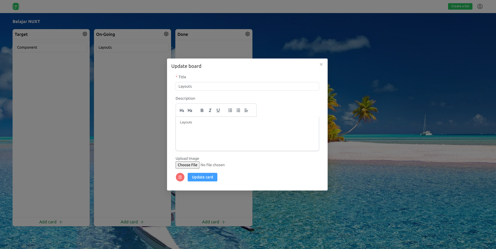

# Nuxt Trello SaaS (nrello)

Nuxtrello is a full-stack web application inspired by Trello. This project is built using Nuxt 3, MongoDB, and Tailwind CSS, focusing on creating an efficient, user-friendly task management and organization tool.

<p align="center">


</p>

## Features

- **Drag and Drop Interface**: Easy-to-use, intuitive interface for managing tasks.
- **User Authentication**: Secure user authentication and authorization using JWT.
- **SAAS Features**: Create and manage multiple boards, lists, and tasks in premium plan. SaaS feature is implemented using Stripe.
- **Responsive Design**: Fully responsive web design for a seamless experience across different devices.
- **Advanced Topics**: Covers advanced concepts like state management, API integration, and more.

# Nuxt 3 Minimal Starter

Look at the [Nuxt 3 documentation](https://nuxt.com/docs/getting-started/introduction) to learn more.

## Setup

Make sure to install the dependencies:

```bash
# npm
npm install

# pnpm
pnpm install

# yarn
yarn install

# bun
bun install
```

## Development Server

Start the development server on `http://localhost:3000`:

```bash
# npm
npm run dev

# pnpm
pnpm run dev

# yarn
yarn dev

# bun
bun run dev
```

## Production

Build the application for production:

```bash
# npm
npm run build

# pnpm
pnpm run build

# yarn
yarn build

# bun
bun run build
```

Locally preview production build:

```bash
# npm
npm run preview

# pnpm
pnpm run preview

# yarn
yarn preview

# bun
bun run preview
```

Check out the [deployment documentation](https://nuxt.com/docs/getting-started/deployment) for more information.
